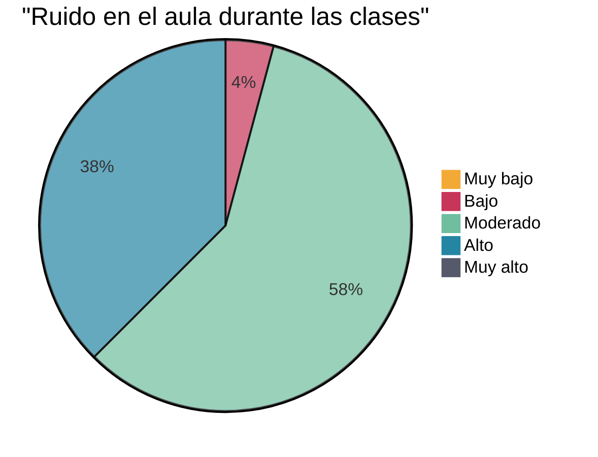
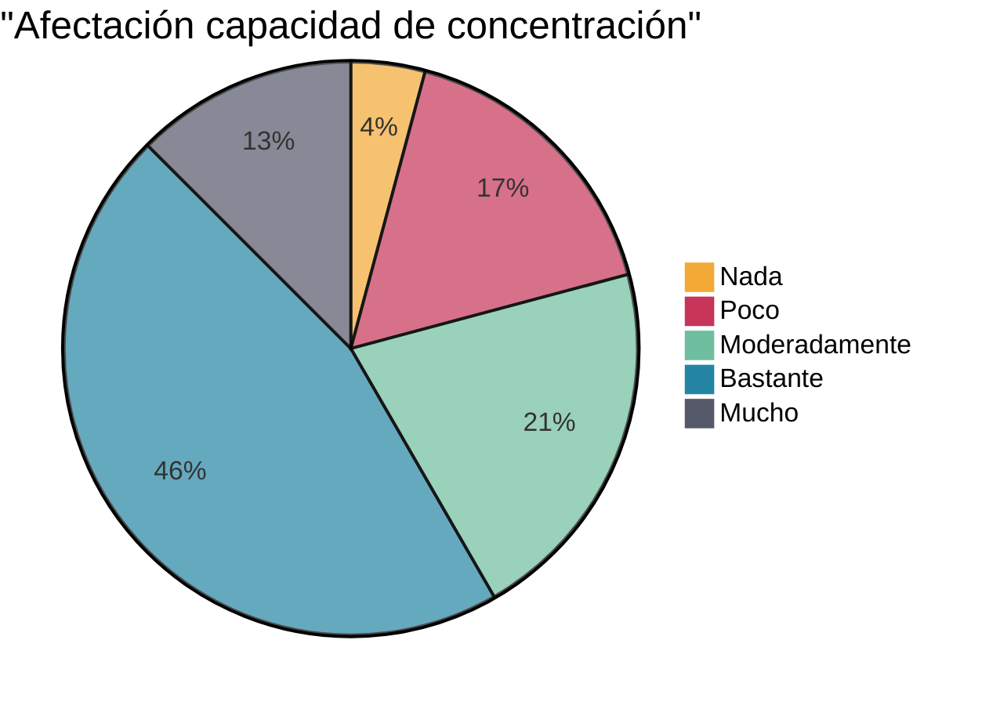
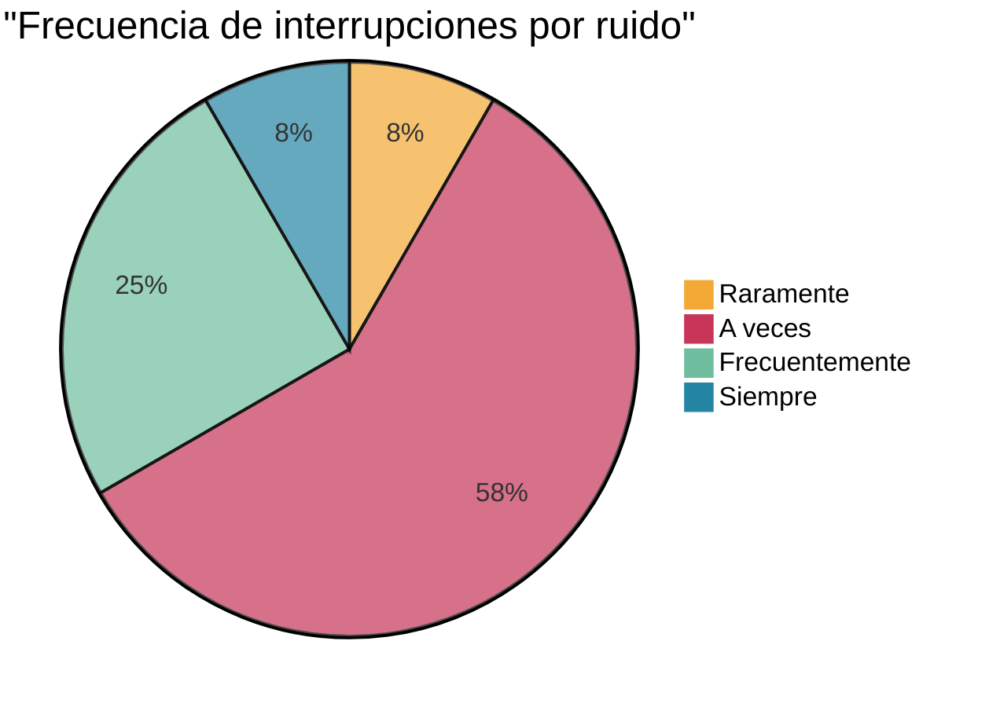
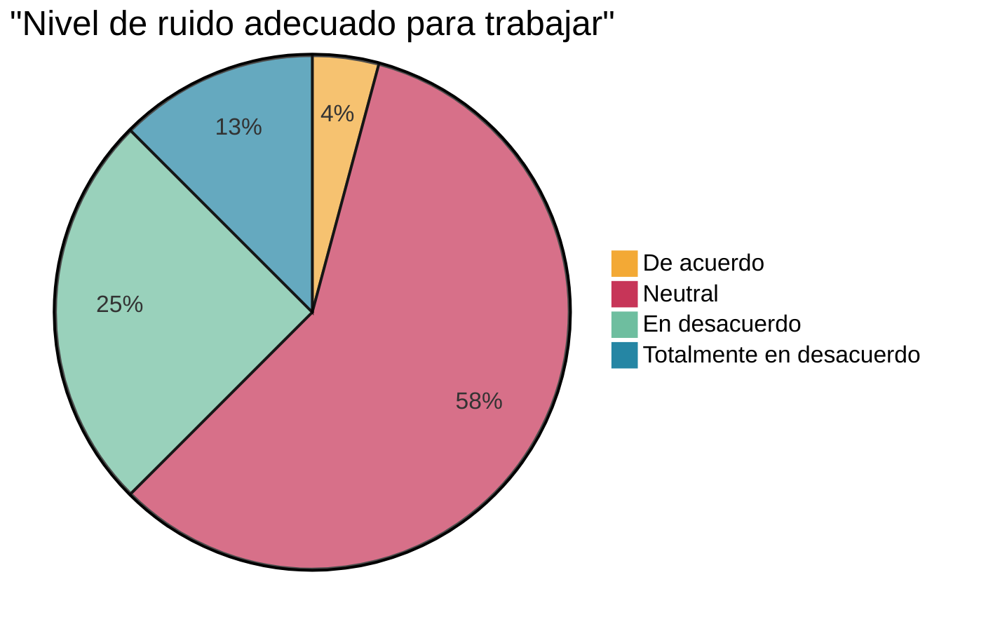
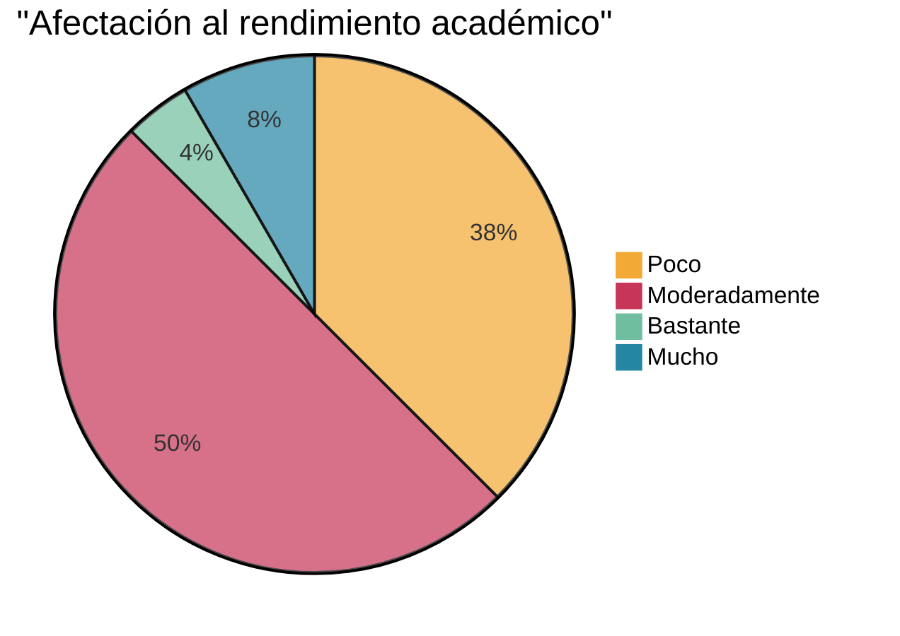
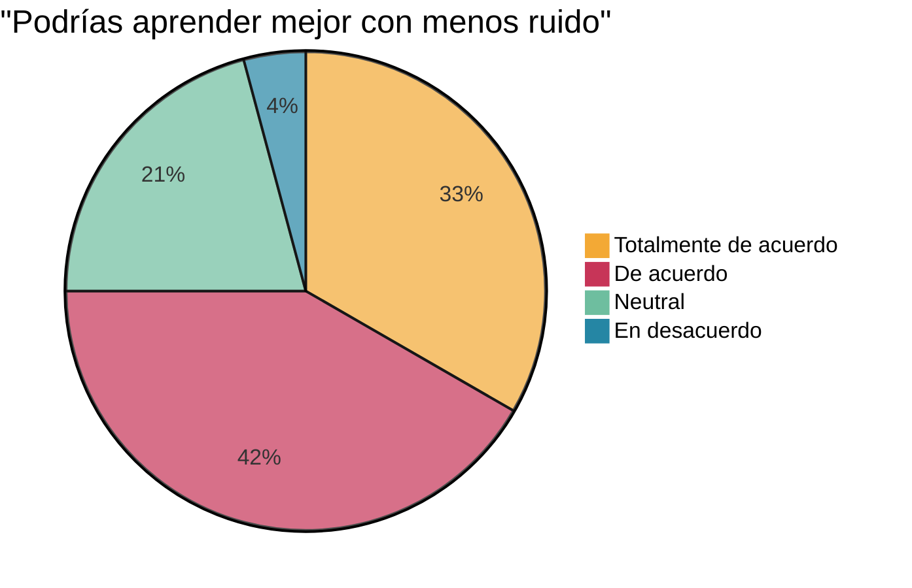
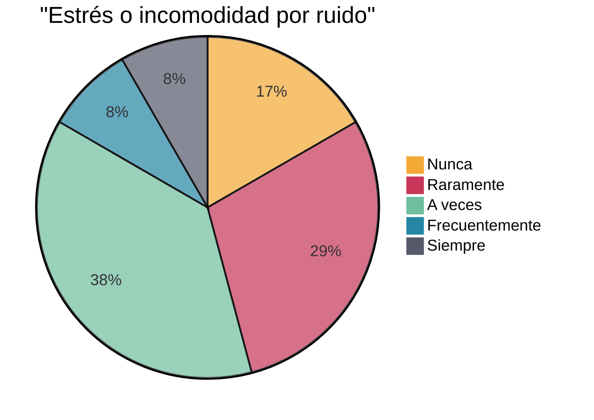
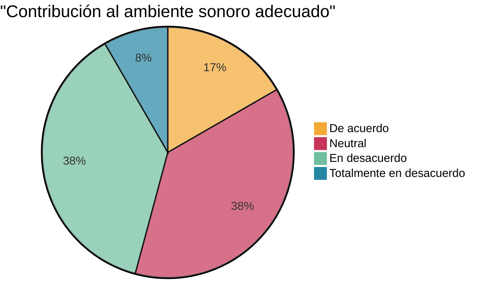
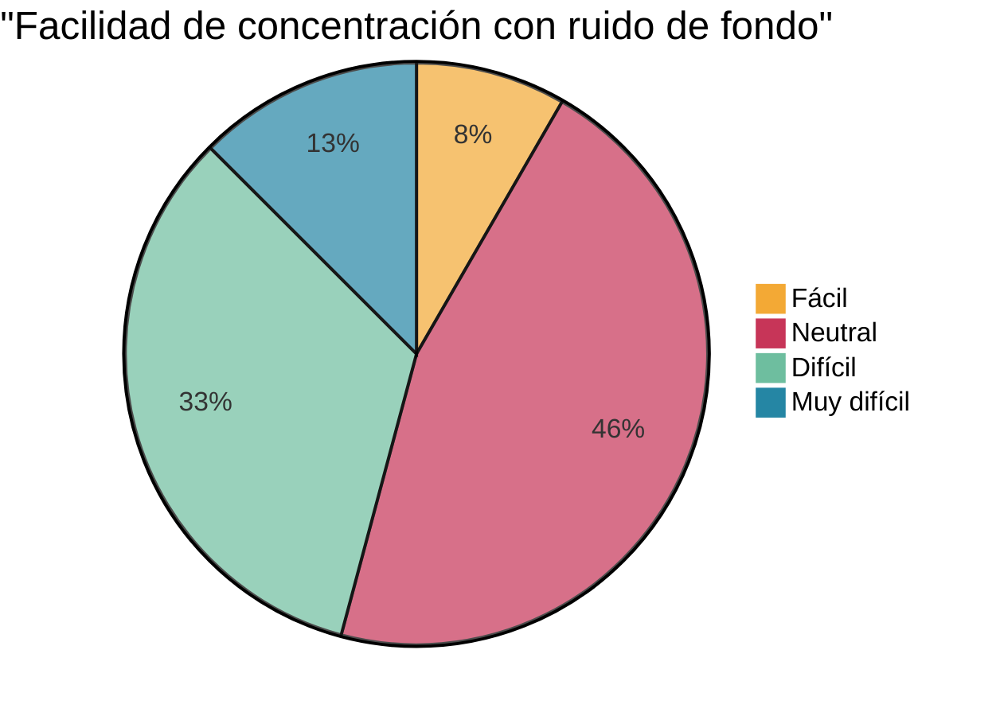
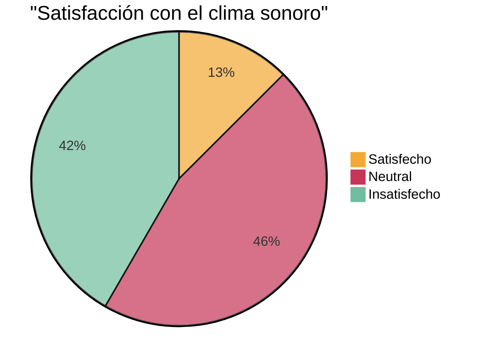

# Resultados de la Encuesta sobre Clima Sonoro en el Aula - Grupo Control

## 1. Nivel de ruido

## 2. Afectación a la concentración

## 3. Interrupciones en explicaciones

## 4. Adecuación del nivel de ruido

## 5. Afectación al rendimiento

## 6. Mejora potencial

## 7. Estrés e incomodidad

## 8. Contribución de estudiantes

## 9. Facilidad de concentración

## 10. Satisfacción general

*Base: 24 estudiantes (100%)*

### Observaciones generales:
1. El 58.33% percibe un nivel de ruido moderado, con 37.5% considerándolo alto.
2. El 58.33% indica que el ruido afecta bastante o mucho su capacidad de concentración.
3. El 75% está de acuerdo o totalmente de acuerdo en que podrían aprender mejor con menos ruido.
4. Solo el 12.5% está satisfecho con el clima sonoro actual, mientras que el 41.67% está insatisfecho.