# Análisis de Resultados - Grupo Experimental

## 1. Nivel de ruido en el aula

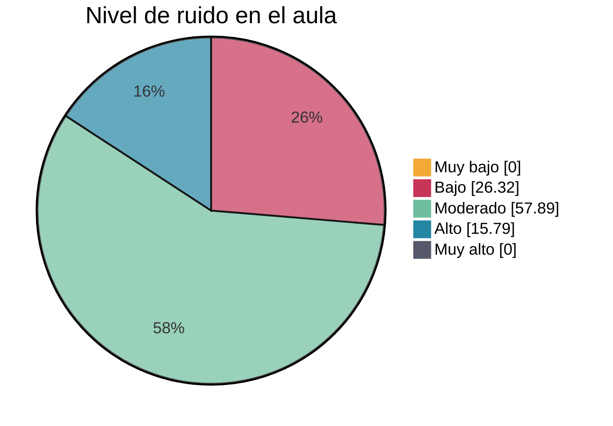

## 2. Afectación a la capacidad de concentración
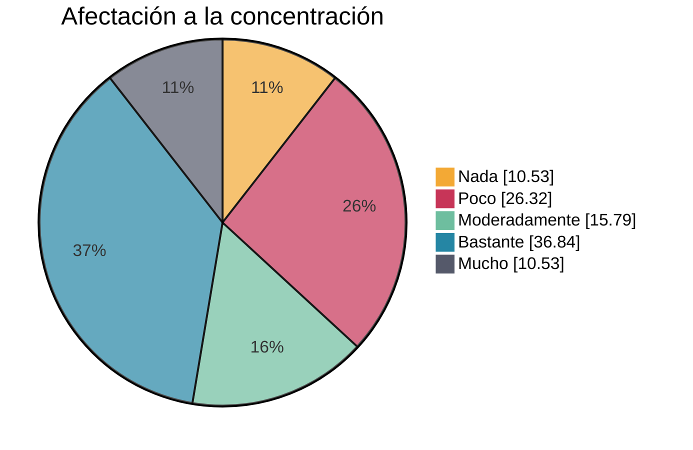

## 3. Interrupciones durante las explicaciones
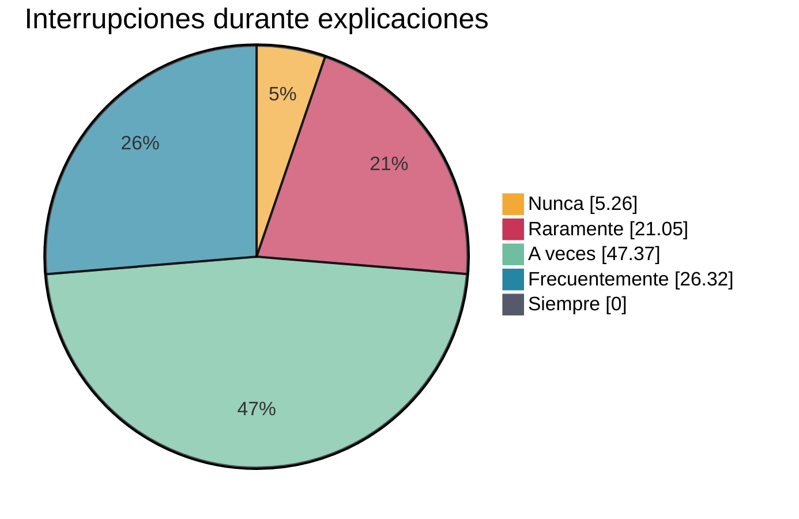

## 4. Nivel adecuado para el trabajo
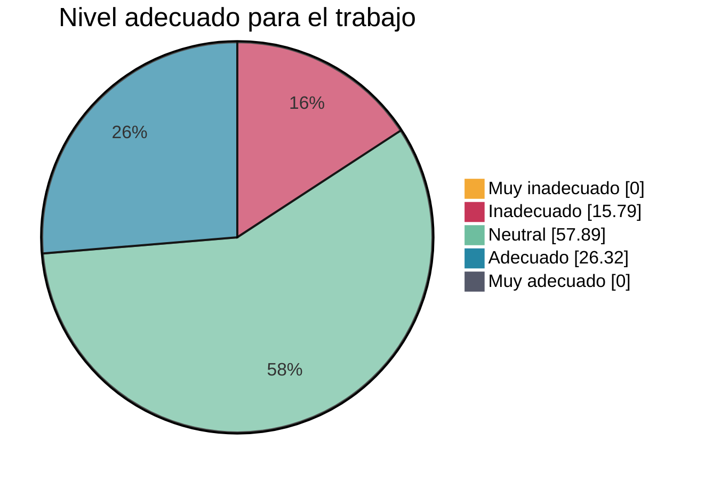

## 5. Afectación al rendimiento académico
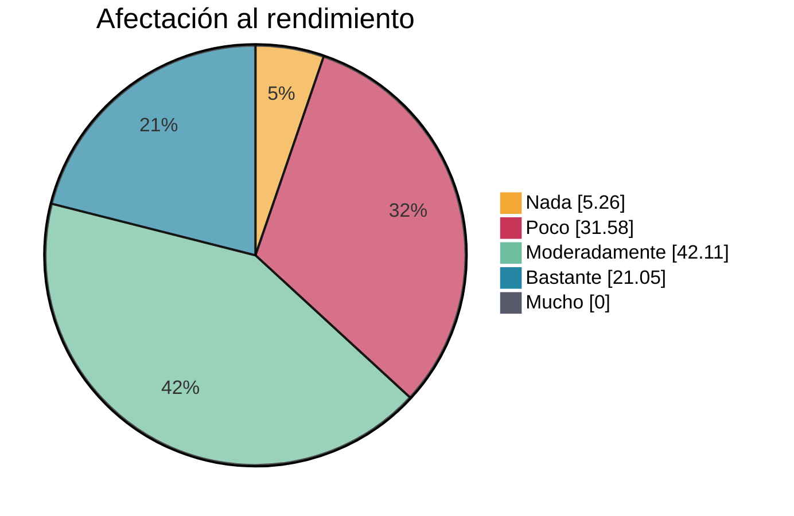

## 6. Mejor rendimiento con menos ruido
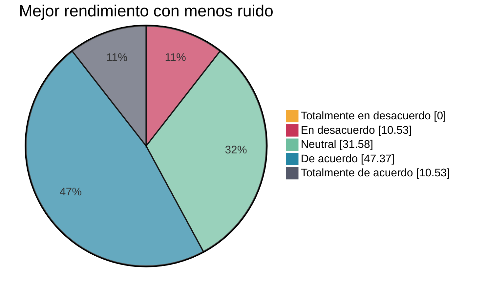

## 7. Generación de estrés
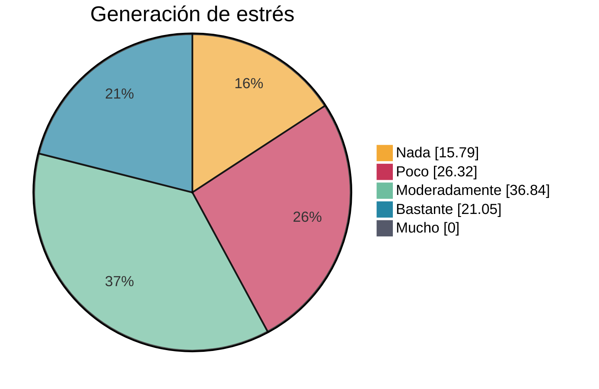

## 8. Contribución de los estudiantes

## 9. Facilidad de concentración
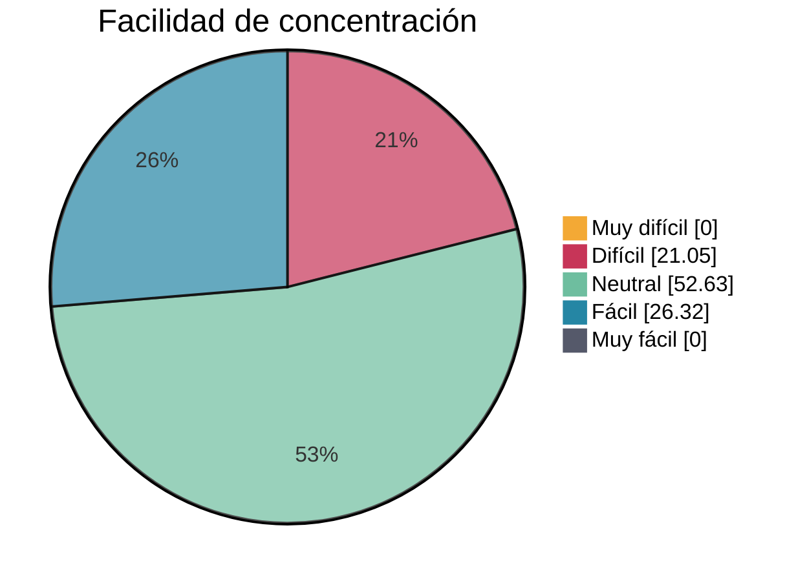

## 10. Satisfacción con el clima sonoro
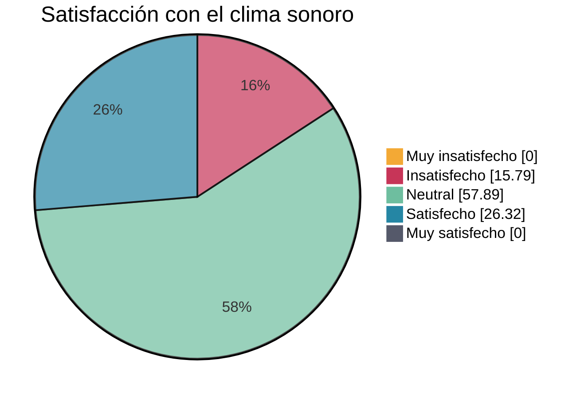

## 11. Mejora con el uso del sonómetro
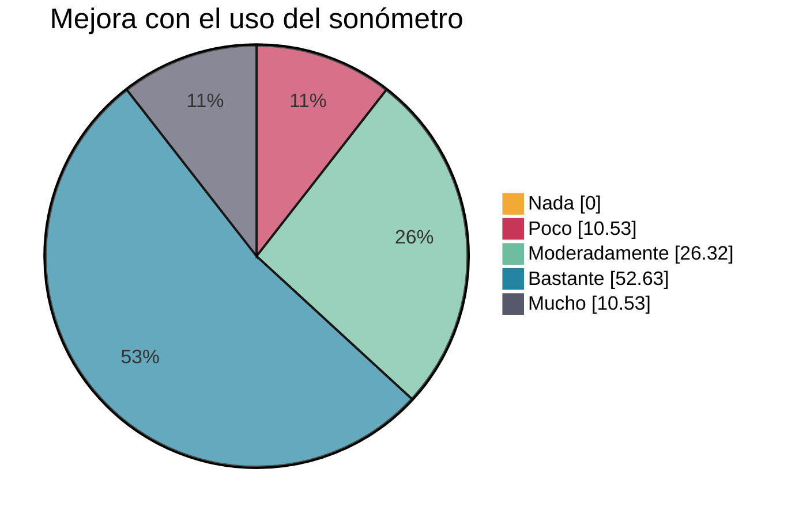

## 12. Mejora en la concentración
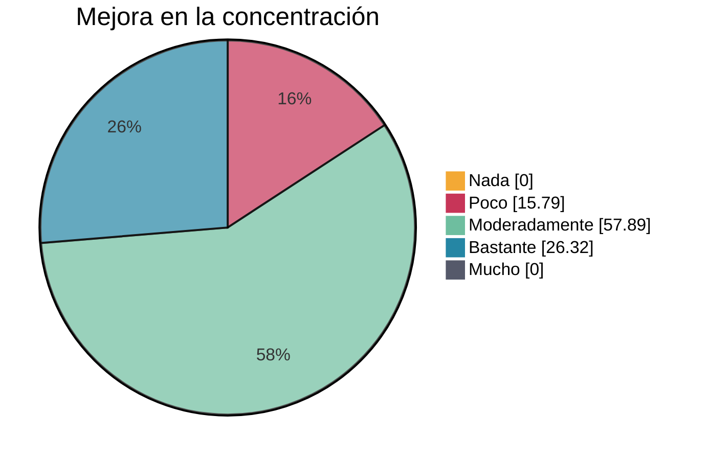

## 13. Implementación en otros módulos
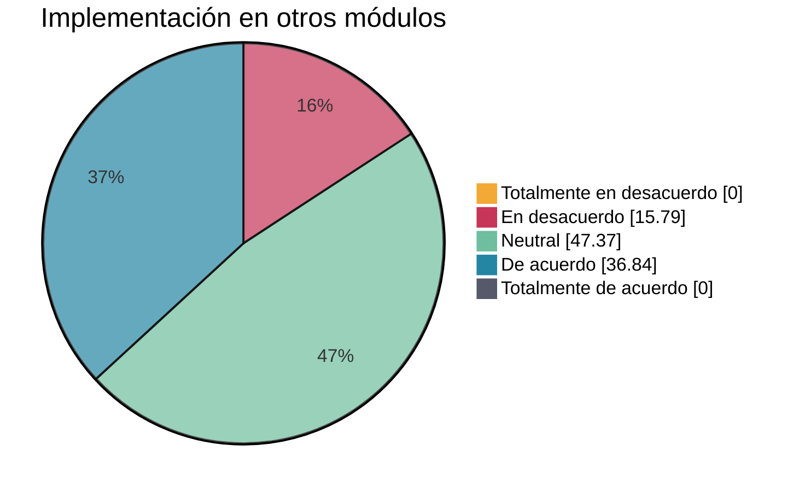

## Observaciones Generales
- La mayoría de los estudiantes (57.89%) percibe un nivel de ruido moderado
- El uso del sonómetro ha sido valorado positivamente, con un 63.16% indicando una mejora significativa
- Hay una tendencia favorable a implementar el proyecto en otros módulos, con un 36.84% de acuerdo
- La concentración ha mejorado moderadamente según el 57.89% de los participantes
- El clima sonoro general se percibe como neutral por la mayoría (57.89%)
- Existe una correlación positiva entre la reducción del ruido y la mejora del rendimiento académico